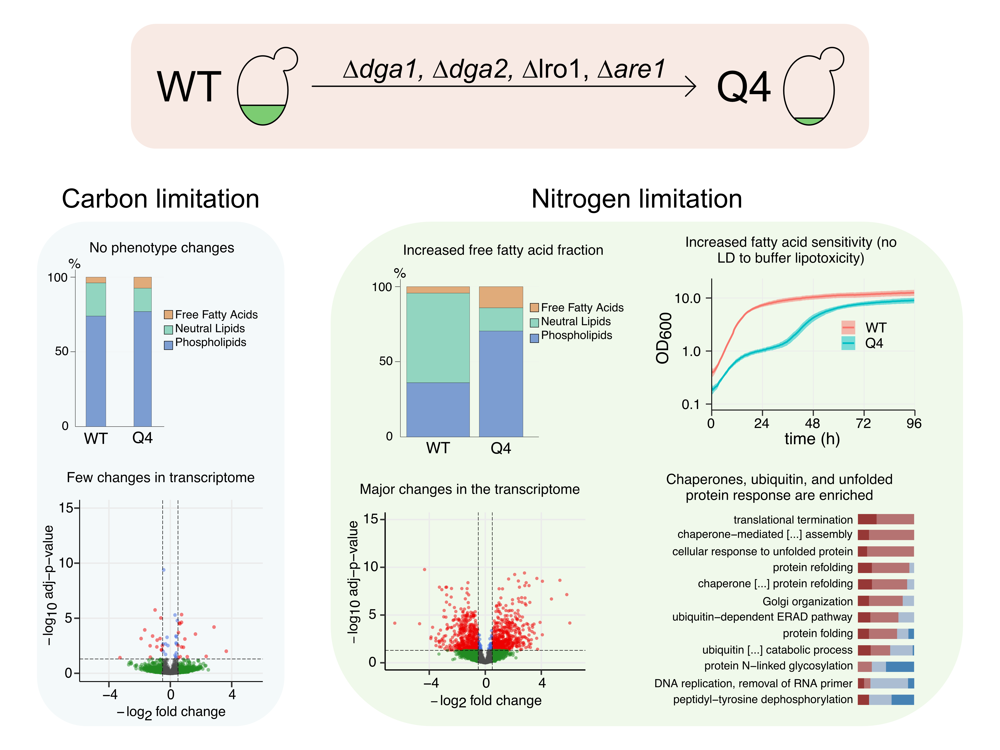

# Yarrowia Multifactor: fat-free strain and urea utilisation

## Repository structure
This repository contains the transcriptome data and scripts used for the analysis of the following papers:

1. "Abolishing storage lipids induces protein misfolding and stress responses in <i> Yarrowia lipolytica </i>"
2. "[Urea is a drop-in nitrogen source alternative to ammonium sulphate in <i>Yarrowia lipolytica</i>](https://doi.org/10.1016/j.isci.2022.105703)";

### Folder structure:
The repository contains two main folders, one for each study:
1. The folder "Fat Free Strain" contains the code used to generate the study "Abolishing storage lipids induces protein misfolding and stress responses in <i> Yarrowia lipolytica </i>".
2. The folder "Urea Utilisation" contains the data and code used to generate the study "Urea is a drop-in nitrogen source alternative to ammonium sulphate in <i>Yarrowia lipolytica</i>". 

Each folder follows the same sub-folder organisation:

* <b>code</b>: contains all the scripts that were used to generate the analysis. This folder contains a "Functions" subfolder in which functions used in the scripts are saved. The script "00.Run_All_Rmds.R" will run all the Rmd files present in the folder which will generate the folder structure of /results and will save the output of the analysis. The script "00.Install_Required_Packages.R" will install all the packages required for the analysis. 

* <b>data</b>: contains all the necessary data used to run the scripts and to reproduce the output of the analysis. 

* <b>docs</b>: contains the documentation of the packages, functions, and pipelines used.

* <b>results</b>: contains the intermediate files and the results generated during the analysis.

## Abstract #1: Fat Free Strain
<i>Yarrowia lipolytica</i> naturally stores carbon excess as lipids. Engineering efforts allow to redirect the high precursor flux required for lipid synthesis towards added value chemicals such as polyketides, flavonoids, and terpenoids. To redirect precursor flux, four genes involved in triacylglycerol and sterol ester synthesis (<i>DGA1</i>, <i>DGA2</i>, <i>LRO1</i>, <i>ARE1</i>) can be deleted, yielding a strain without storage lipids. To elucidate the effect of the deletions on cell physiology and regulation, we performed chemostat cultivations under carbon limitation and under nitrogen limitation. We found that lipid free cells show an altered lipid class distribution with abundance of potentially cytotoxic free fatty acids under nitrogen limitation. Lipid free cells also show an enrichment of the unfolded protein response, and several GO terms related to protein refolding and misfolded protein degradation enriched. Our results suggest an important connection between lipid metabolism, lipid droplets, and the clearance of misfolded proteins to ensure cell homeostasis.

## Abstract #2: Urea Utilisation
Media components, including the nitrogen source, are significant cost factors in cultivation processes. The nitrogen source also influences the cell behaviour and its production performance. Ammonium sulphate is a widely used nitrogen source for the cultivation of microorganisms. Urea is a sustainable and cheap alternative nitrogen source. We investigated the influence of urea as a nitrogen source compared to ammonium sulphate by cultivating three phenotypically very different <i>Yarrowia lipolytica</i> strains in chemostats under carbon- or nitrogen limiting conditions. We found no significant coherent changes in growth and lipid production between nitrogen sources. RNA sequencing revealed no significant concerted changes in the transcriptome due to the different nitrogen sources. We also showed that the genes involved in urea uptake and degradation are not up-regulated on a transcriptional level. Our findings support urea usage as a nitrogen source, indicating that previous metabolic engineering efforts where ammonium sulfate was used are likely translatable to the usage of urea and can ease the way for urea as a cheap and sustainable nitrogen source in more applications. 

